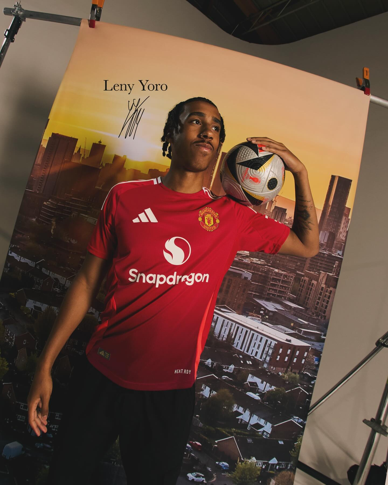
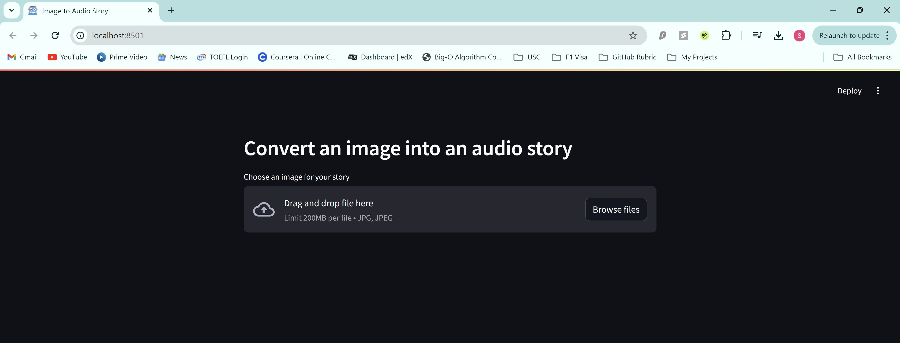

## Example Implementation

### Input Image fed to the model


### Audio Output Generated
<audio controls>
  <source src="[Output Audio](https://github.com/shounakda5/llm-image2speech-app/blob/main/assets/audio.mp3)" type="audio/mpeg">
  Your browser does not support the audio element.
</audio>

## Web UI


## Using this Repository

Clone this repository into your preferred directory and generate the necessary API tokens

### API Tokens
- 🤗 Huggng Face Read Type Access Token: To render Hugging Face Models for image-to-text and text-to-speech conversion.
- 🤖 OpenAI API Token: Add Billing Credit to your Open AI account.

### Running the model:
Run the app.py file using the streamlit library to render the web application on your localhost.
```bash
streamlit run app.py
```
 
